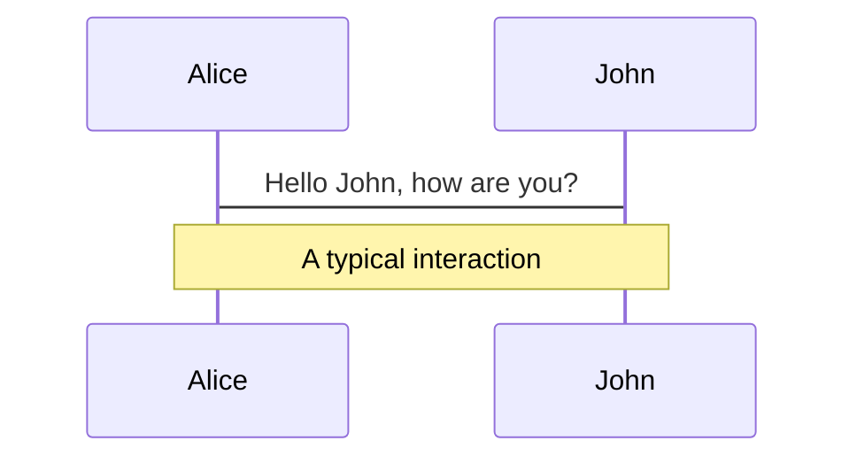
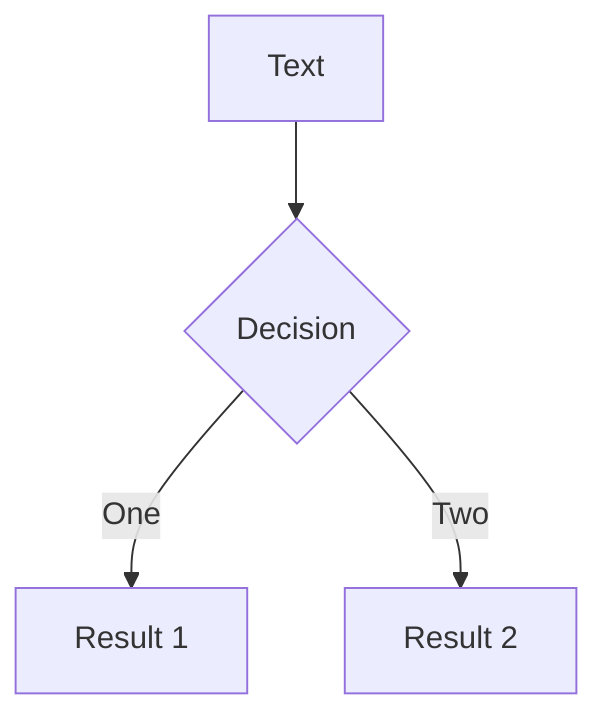

---
# try also 'default' to start simple
theme: default
# random image from a curated Unsplash collection by Anthony
# like them? see https://unsplash.com/collections/94734566/slidev
# background: ./public/vid/01.mp4
layout: cover
# apply any windi css classes to the current slide
class: 'text-center'
# https://sli.dev/custom/highlighters.html
highlighter: shiki
# show line numbers in code blocks
lineNumbers: false
# some information about the slides, markdown enabled
info: |
  ## Slidev Starter Template
  Presentation slides for developers.

  Learn more at [Sli.dev](https://sli.dev)
# persist drawings in exports and build
drawings:
  persist: false
---

<h1 style="color:black">Concurrency Patterns</h1>

<!-- <div class="pt-12">
  <span @click="$slidev.nav.next" class="px-2 py-1 rounded cursor-pointer" hover="bg-white bg-opacity-10">
    Press Space for next page <carbon:arrow-right class="inline"/>
  </span>
</div> -->

<video autoplay muted loop id="myVideo">
  <source src="/vid/background_yellow.mp4" type="video/mp4">
  Your browser does not support HTML5 video.
</video>

<style>
#myVideo {
  z-index: -10;
  position: fixed;
  right: 0;
  bottom: 0;
  min-width: 100%;
  min-height: 100%;
}
</style>

---

<video autoplay muted loop id="myVideo">
  <source src="/vid/concurrent_world.mp4" type="video/mp4">
  Your browser does not support HTML5 video.
</video>

<style>
#myVideo {
  z-index: -10;
  position: fixed;
  right: 0;
  bottom: 0;
  min-width: 100%;
  min-height: 100%;
}
</style>

<style>
h1 {
  background-color: #2B90B6;
  background-image: linear-gradient(45deg, #4EC5D4 10%, #146b8c 20%);
  background-size: 100%;
  -webkit-background-clip: text;
  -moz-background-clip: text;
  -webkit-text-fill-color: transparent;
  -moz-text-fill-color: transparent;
}
</style>

---

<video autoplay muted loop id="myVideo">
  <source src="/vid/more_people.mp4" type="video/mp4">
  Your browser does not support HTML5 video.
</video>

<style>
#myVideo {
  z-index: -10;
  position: fixed;
  right: 0;
  bottom: 0;
  min-width: 100%;
  min-height: 100%;
}
</style>


---

<video autoplay muted loop id="myVideo">
  <source src="/vid/elevators.mp4" type="video/mp4">
  Your browser does not support HTML5 video.
</video>

<style>
#myVideo {
  z-index: -10;
  position: fixed;
  right: 0;
  bottom: 0;
  min-width: 100%;
  min-height: 100%;
}
</style>

---

<video autoplay muted loop id="myVideo">
  <source src="/vid/pegeons.mp4" type="video/mp4">
  Your browser does not support HTML5 video.
</video>

<style>
#myVideo {
  z-index: -10;
  position: fixed;
  right: 0;
  bottom: 0;
  min-width: 100%;
  min-height: 100%;
}
</style>

---
layout: image
---


<style>
img {
  z-index: -10;
  position: absolute;
  right: 0;
  top: 0;
  min-width: 100%;
  min-height: 100%;
  object-fit: cover;
}
</style>


---
layout: image
---


<style>
img {
  z-index: -10;
  position: absolute;
  right: 0;
  top: 0;
  min-width: 100%;
  min-height: 100%;
  object-fit: cover;
}
</style>

---

<video autoplay muted loop id="myVideo">
  <source src="/vid/airport_conc.mp4" type="video/mp4">
  Your browser does not support HTML5 video.
</video>

<style>
#myVideo {
  z-index: -10;
  position: fixed;
  right: 0;
  bottom: 0;
  min-width: 100%;
  min-height: 100%;
}
</style>

---

<video autoplay muted loop id="myVideo">
  <source src="/vid/airport_conc2.mp4" type="video/mp4">
  Your browser does not support HTML5 video.
</video>

<style>
#myVideo {
  z-index: -10;
  position: fixed;
  right: 0;
  bottom: 0;
  min-width: 100%;
  min-height: 100%;
}
</style>

---

<video autoplay muted loop id="myVideo">
  <source src="/vid/airport_par.mp4" type="video/mp4">
  Your browser does not support HTML5 video.
</video>

<style>
#myVideo {
  z-index: -10;
  position: fixed;
  right: 0;
  bottom: 0;
  min-width: 100%;
  min-height: 100%;
}
</style>

---
layout: image
---


<style>
img {
  z-index: -10;
  position: absolute;
  right: 0;
  top: 0;
  min-width: 100%;
  min-height: 100%;
  object-fit: cover;
}
</style>

---
layout: image
---


<style>
img {
  z-index: -10;
  position: absolute;
  right: 0;
  top: 0;
  min-width: 100%;
  min-height: 100%;
  object-fit: cover;
}
</style>

---
layout: image
---


<style>
img {
  z-index: -10;
  position: absolute;
  right: 0;
  top: 0;
  min-width: 100%;
  min-height: 100%;
  object-fit: cover;
}
</style>

---
layout: image
---


<style>
img {
  z-index: -10;
  position: absolute;
  right: 0;
  top: 0;
  min-width: 100%;
  min-height: 100%;
  object-fit: cover;
}
</style>

---
layout: full
---

## Operating system level:

<br>

- Processes
- Threads

<v-click>

## Programming language level:

<br>

- Coroutines
- Futures and promises (async)

</v-click>

<style>
font-size: 24px;
</style>

---
layout: center
---

# Threading

C++, Java, Rust, Haskell,...

```cpp {all|10|4-6|14|all}
#include <iostream>
#include <thread>

void foo(int a) {
    std::cout << a << '\n';
}

int main() {

    std::thread thread(foo, 10);

    // Keep going; the thread is executed separately

    thread.join();

    return 0;
}

```

---
layout: image
---


<style>
img {
  z-index: -10;
  position: absolute;
  right: 0;
  top: 0;
  min-width: 100%;
  min-height: 100%;
  object-fit: cover;
}
</style>


---
layout: center
---


<style>
img {
  z-index: -10;
  position: absolute;
  right: 0;
  top: 30px;
  min-width: 100%;
  max-height: 87%;
  object-fit: contain;
}
</style>

---
layout: statement
---

But what if I want <b><span class="text-red-500">a lot</span></b> of threads?

---
layout: full
---

<!-- <span style="color:yellow; font-size: 32px; font-weight: bold;">..also shared memory</span> -->


<style>
img {
  z-index: -10;
  position: absolute;
  right: 0;
  top: 0;
  min-width: 100%;
  min-height: 100%;
  object-fit: cover;
}
</style>

---
layout: statement
---

problems here maybe?

---
layout: full
---

<div style="color: #404040;">

<h2> Operating system level:</h2>

<br>

- Processes
- Threads

</div>
<br>

<v-click>

## Programming language level:

<br>

- Coroutines
- Futures and promises (async)

</v-click>

<style>
font-size: 24px;
</style>

---


---
layout: image-right
image: https://source.unsplash.com/collection/94734566/1920x1080
---

# Code

Use code snippets and get the highlighting directly![^1]

```ts {all|2|1-6|9|all}
interface User {
  id: number
  firstName: string
  lastName: string
  role: string
}

function updateUser(id: number, update: User) {
  const user = getUser(id)
  const newUser = {...user, ...update}
  saveUser(id, newUser)
}
```

<arrow v-click="3" x1="400" y1="420" x2="230" y2="330" color="#564" width="3" arrowSize="1" />

[^1]: [Learn More](https://sli.dev/guide/syntax.html#line-highlighting)

<style>
.footnotes-sep {
  @apply mt-20 opacity-10;
}
.footnotes {
  @apply text-sm opacity-75;
}
.footnote-backref {
  display: none;
}
</style>

---

# Components

<div grid="~ cols-2 gap-4">
<div>

You can use Vue components directly inside your slides.

We have provided a few built-in components like `<Tweet/>` and `<Youtube/>` that you can use directly. And adding your custom components is also super easy.

<!-- ```html -->
<!-- <Counter :count="10" /> -->
<!-- ``` -->

<!-- ./components/Counter.vue -->
<!-- <Counter :count="10" m="t-4" /> -->

Check out [the guides](https://sli.dev/builtin/components.html) for more.

</div>
<div>

```html
<Tweet id="1390115482657726468" />
```

<Tweet id="1390115482657726468" scale="0.65" />

</div>
</div>


---
class: px-20
---

# Themes

Slidev comes with powerful theming support. Themes can provide styles, layouts, components, or even configurations for tools. Switching between themes by just **one edit** in your frontmatter:

<div grid="~ cols-2 gap-2" m="-t-2">

```yaml
---
theme: default
---
```

```yaml
---
theme: seriph
---
```


</div>

Read more about [How to use a theme](https://sli.dev/themes/use.html) and
check out the [Awesome Themes Gallery](https://sli.dev/themes/gallery.html).

---
preload: false
---

# Animations

Animations are powered by [@vueuse/motion](https://motion.vueuse.org/).

```html
<div
  v-motion
  :initial="{ x: -80 }"
  :enter="{ x: 0 }">
  Slidev
</div>
```

<div class="w-60 relative mt-6">
  <div class="relative w-40 h-40">
    
    
    
  </div>

  <div
    class="text-5xl absolute top-14 left-40 text-[#2B90B6] -z-1"
    v-motion
    :initial="{ x: -80, opacity: 0}"
    :enter="{ x: 0, opacity: 1, transition: { delay: 2000, duration: 1000 } }">
    Slidev
  </div>
</div>

<!-- vue script setup scripts can be directly used in markdown, and will only affects current page -->
<script setup lang="ts">
const final = {
  x: 0,
  y: 0,
  rotate: 0,
  scale: 1,
  transition: {
    type: 'spring',
    damping: 10,
    stiffness: 20,
    mass: 2
  }
}
</script>

<div
  v-motion
  :initial="{ x:35, y: 40, opacity: 0}"
  :enter="{ y: 0, opacity: 1, transition: { delay: 3500 } }">

[Learn More](https://sli.dev/guide/animations.html#motion)

</div>

---

# LaTeX

LaTeX is supported out-of-box powered by [KaTeX](https://katex.org/).

<br>

Inline $\sqrt{3x-1}+(1+x)^2$

Block
$$
\begin{array}{c}

\nabla \times \vec{\mathbf{B}} -\, \frac1c\, \frac{\partial\vec{\mathbf{E}}}{\partial t} &
= \frac{4\pi}{c}\vec{\mathbf{j}}    \nabla \cdot \vec{\mathbf{E}} & = 4 \pi \rho \\

\nabla \times \vec{\mathbf{E}}\, +\, \frac1c\, \frac{\partial\vec{\mathbf{B}}}{\partial t} & = \vec{\mathbf{0}} \\

\nabla \cdot \vec{\mathbf{B}} & = 0

\end{array}
$$

<br>

[Learn more](https://sli.dev/guide/syntax#latex)

---

# Diagrams

You can create diagrams / graphs from textual descriptions, directly in your Markdown.

<div class="grid grid-cols-2 gap-10 pt-4 -mb-6">





</div>

[Learn More](https://sli.dev/guide/syntax.html#diagrams)


---
layout: center
class: text-center
---

# Learn More

[Documentations](https://sli.dev) · [GitHub](https://github.com/slidevjs/slidev) · [Showcases](https://sli.dev/showcases.html)
